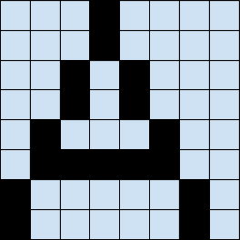
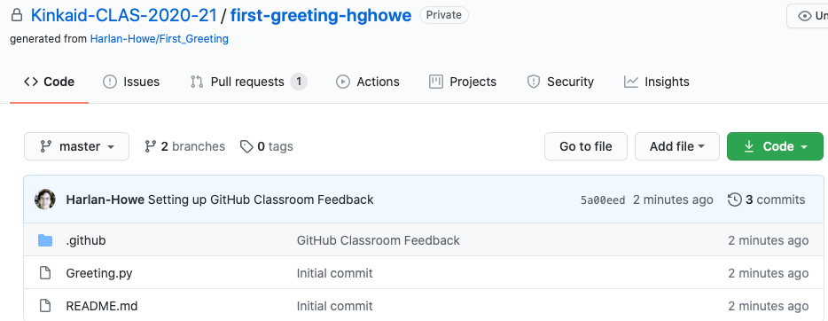

<html><head><meta content="text/html; charset=UTF-8" http-equiv="content-type"></head><body class="c22">
APCS&nbsp;&nbsp;&nbsp;&nbsp;&nbsp;&nbsp;&nbsp;&nbsp;August 27, 2020

Numerical Image Decompression

In this project we&#39;re looking at a way that a black-and-white pixelated image can be represented as a sequence of numbers. For instance, consider the following 8 x 8 image:

<table class="c16"><tbody><tr class="c17"><td class="c12" colspan="1" rowspan="8">

</td><td class="c0" colspan="1" rowspan="1">
3 light, 1 dark, 4 light
</td></tr><tr class="c17"><td class="c0" colspan="1" rowspan="1">
3 light, 1 dark, 4 light
</td></tr><tr class="c17"><td class="c0" colspan="1" rowspan="1">
2 light, 1 dark, 1 light, 1 dark, 3 light
</td></tr><tr class="c17"><td class="c0" colspan="1" rowspan="1">
2 light, 1 dark, 1 light, 1 dark, 3 light
</td></tr><tr class="c17"><td class="c0" colspan="1" rowspan="1">
1 light, 1 dark, 3 light, 1 dark, 2 light
</td></tr><tr class="c17"><td class="c0" colspan="1" rowspan="1">
1 light, 5 dark, 2 light
</td></tr><tr class="c17"><td class="c0" colspan="1" rowspan="1">
1 dark, 5 light, 1 dark, 1 light
</td></tr><tr class="c17"><td class="c0" colspan="1" rowspan="1">
1 dark, 5 light, 1 dark, 1 light
</td></tr></tbody></table>

Since we keep alternating the light and dark values, we might even choose just use the numbers, assuming we always start with light:

3 1 4

3 1 4

2 1 1 1 3

2 1 1 1 3

1 1 3 1 2

1 5 2

0 1 5 1 1

0 1 5 1 1

(Note the zeroes on the last two lines&hellip; and consider why they are there. Would it make sense to have zeros in the middle of a line?)

In fact, since we know we always have eight values in each row, we could just use one stream of numbers:

3 1 4 3 1 4 2 1 1 1 3 2 1 1 1 3 1 1 3 1 2 1 5 2 0 1 5 1 1 0 1 5 1 1

&hellip; although this would be harder to understand for humans.

Your job in this project is to ask the user for a width and height, then a stream of numbers - and to draw the image that it represents.

For example, here is the output for a sample run:
<table class="c16"><tbody><tr class="c2"><td class="c5" colspan="1" rowspan="1">
Enter the width and height of the image, separated by spaces: 8 8

You chose a (8 x 8) image.

Enter the numbers you wish to interpret. 3 1 4 3 1 4 2 1 1 1 3 2 1 1 1 3 1 1 3 1 2 1 5 2 0 1 5 1 1 0 1 5 1 1

...M....

...M....

..M.M...

..M.M...

.M...M..

.MMMMM..

M.....M.

M.....M.

Done.
</td></tr></tbody></table>

&hellip; In this case, I am using a period for the &quot;light&quot; cells and an &quot;M&quot; for the dark ones. (&quot;M&quot; just has a lot of dark pixels. Other candidates might be &quot;W,&quot; &quot;#&quot; or &quot;@.&quot;) You can use whatever you like. And, yes, a space makes better sense for the light cells&hellip; when you&#39;re done debugging.

Here are some relevant Java tips:
<table class="c16"><tbody><tr class="c2"><td class="c5 c28" colspan="1" rowspan="1">
Something to notice here is that if the user types in two numbers (e.g., &quot;8 8&quot;), the Scanner&#39;s nextInt()&nbsp;method will read the first 8 and &quot;save&quot; the remaining &quot; 8&quot; for later - i.e., another call to nextInt(). So when we enter the long list of numbers, the computer can treat this as if it were reading them one at a time from the user.
</td></tr><tr class="c2"><td class="c5 c28" colspan="1" rowspan="1">
When checking whether to numbers (a and b) are the same, we say:

if (a == b)

but when we check whether two Strings (word1 and word2) are the same, we say:

if (word1.equals(word2))

If you use the &quot;==&quot; with strings it will check whether the strings&#39; memory locations match, which is probably not what you want.
</td></tr><tr class="c2"><td class="c5 c28" colspan="1" rowspan="1">
If you are in the middle of a while() or for() loop, and you wish to exit immediately, you can use the break; command, which is frequently found in the curly brackets section of an if&nbsp;statement. This will exit the loop, regardless of whether the expression in the while&#39;s&nbsp;parentheses is true or not, and move the operation point to immediately after the loop.

(If you have nested loops, and a break occurs inside the inner one, it will only jump out of the inner loop.)

This is how you get out of a while(true) loop, which would otherwise run forever.
</td></tr></tbody></table>

Getting the starter code. (This is the same as for Brute Force Graphing, but with a different link.)
<ul class="c20 lst-kix_rn79zdl5jqk3-0 start"><li class="c3 c11">Click on this link: &nbsp;<a class="c8" href="https://www.google.com/url?q=https://classroom.github.com/a/jBJZoI-D&amp;sa=D&amp;ust=1598626933269000&amp;usg=AOvVaw3hO3oC-nVR33DoCwW8s3si">https://classroom.github.com/a/jBJZoI-D</a>&nbsp;to take you to a page inviting you to the github classroom assignment. You will likely need to log in with your github account.</li><li class="c3 c11">If this is your first time doing one of these assignments, you should see a list of names - please pick your own.</li><li class="c3 c11">There should be a button prompting you to &quot;accept&quot; this assignment.<a href="#ftnt1" id="ftnt_ref1">[1]</a></li><li class="c3 c11 c25">After a brief pause, you&#39;ll get a message saying you&#39;re ready to go, with a url on it. Go ahead and click on this URL.</li><li class="c19 c11 c31 c25 c32">You should see something similar to this. (This is for a different assignment for a different class for a different student, but the overall appearance should be similar.) </li><li class="c3 c11 c25">Click on the green &quot;Code&quot; button. You&#39;ll see the start of a (mighty similar) URL here, too. Click on the clipboard icon next to it to copy this URL into your clipboard.</li><li class="c3 c11 c25">Launch IntelliJ IDEA on your computer, and then&hellip;</li></ul><ul class="c20 lst-kix_rn79zdl5jqk3-1 start"><li class="c4 c11 c21">If you are seeing the IntelliJ greeting screen, click &quot;Get From Version Control.&quot;</li><li class="c4 c21 c11">Otherwise, go to File menu &rarr;&nbsp;New &rarr; &quot;Project from Version Control&hellip;&quot;</li></ul><ul class="c20 lst-kix_rn79zdl5jqk3-0"><li class="c3 c11 c25">In the window that appears, paste the URL you just copied into the URL field. &nbsp;Use the Directory field to modify where you want this project to go on your computer.</li><li class="c3 c11 c25">The project should open up with my starter code.</li></ul>

I would like to draw your attention to the top of the main() method - I&#39;ve created some variables that I would like to recommend to you, because I think you will find them useful. 

In addition to what we have seen, let us make our program a bit more forgiving: 
<ol class="c20 lst-kix_ikqjol2rue8a-0 start" start="1"><li class="c3 c11">If a user types in a number that would cause us to go past the end of a row, we&#39;ll just draw however many characters as are left in the row and ignore the rest. For example, if we have an image width of 6 and type 2 3 12 for that row, we&#39;ll get:  &nbsp; &nbsp;..MMM. and the remaining 11 dots of the &quot;12&quot; will be discarded.</li><li class="c3 c11">If the user types in a negative number, that will fill in the rest of the row - think of &quot;-1&quot; as equivalent to &quot;imageWidth.&quot;</li><li class="c3 c11">If the user types in more numbers that would create extra lines on the image, they are ignored. Only the correct number of rows will be drawn.</li></ol>

A few things to check for yourself, in addition to (a - c), above:
<ul class="c20 lst-kix_su2ge9ao5tje-0 start"><li class="c3 c11">The program should work just as well if you end a row with an exact count as with an overflow, like in (a).</li><li class="c3 c11">Starting a row with 0 should work as expected.</li><li class="c3 c11">Ending a row with a light cell or a dark cell should not impact the appearance of the next row.</li><li class="c3 c11">If the user types in too few numbers to make the full shape, it will draw what it can and let the user type in more numbers (without a prompt) and continue from there. If the numbers run out in the middle of that row, you don&#39;t have to continue at the indentation where you left off; that row will just be messed up, but the next row should be able to print correctly. (Honestly, this is the normal behavior that I think will happen naturally - I am giving you permission not to stress out about it!)</li></ul>

Turning this project in

We will discuss in class what you need to do to turn this in via Github Classroom, but I also am asking you to add something to this document In the table below, share a picture with me: give me width and height on one line, and on the next, the numbers that make the picture.
<table class="c16"><tbody><tr class="c2"><td class="c5" colspan="1" rowspan="1">
Width &amp; Height:
</td></tr><tr class="c2"><td class="c5" colspan="1" rowspan="1">
Numbers
</td></tr></tbody></table>

<a href="#ftnt_ref1" id="ftnt1">[1]</a>&nbsp;Sounds like something out of Mission Impossible,&nbsp;doesn&#39;t it?

</body></html>